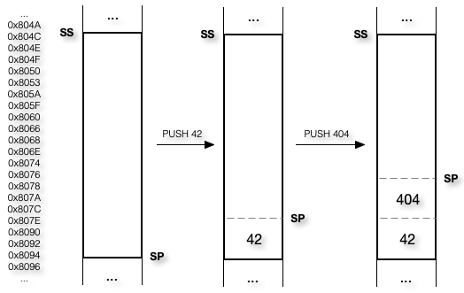
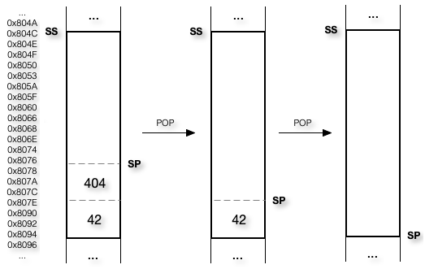

Bien qu’il soit beaucoup plus facile d’écrire un programme en langage assembleur plutôt qu’en langage machine, le travail reste fastidieux, sujet aux erreurs, et tout de même réservé aux programmeurs expérimentés puisqu’il nécessite de bonnes connaissances de la machine et de ses rouages internes.

# Historique

Ingénieur électrique, diplômé du MIT en 1941, Nathaniel Rochester commence à travailler chez IBM en 1948 afin de concevoir l’un des premiers ordinateurs polyvalent. Et c’est en 1954 qu’il écrit le premier programme en Assembleur pour l’IBM 701.

# Source

Du code informatique écrit avec un langage de programmation est nommé « code source ».

## Syntaxe

Exceptionnellement, deux syntaxes différentes sont utilisées pour le langage Assembleur.

Ayant été conçu dans les laboratoires Bell de AT&T, c'est le titre qui est donné à la première syntaxe. Le compilateur étant plus rudimentaire, cette syntaxe est un peu plus complexe.

Avec la venue des premiers ordinateurs personnels par Intel, c'est ce titre qui est donné à la deuxième syntaxe. Les compilateurs étant un peu plus évolués, la syntaxe a été simplifiée pour la rendre un peu plus intuitive.

# Instructions

Le processeur ne fait pas que contenir des registres, son utilité principale est d'exécuter des instructions.

Nous ne verrons pas chacune de ses instructions, seulement quelques-unes qui nous permettront de comprendre de simples programmes écrits en langage assembleur.

## MOV

L’architecture x64 permet d’affecter un registre ou un espace en mémoire centrale d’un autre registre ou d’un autre espace en mémoire centrale ou d’une constante.

```assembly
mov ax, bx             ; Registre <- Registre
mov bx, 42             ; Registre <- Constante
mov cx, [adresse]      ; Registre <- Mémoire
mov [adresse], dx      ; Mémoire  <- Registre
mov word [adresse], 42 ; Mémoire  <- Constante
```

## XOR

L’architecture x64 permet d’effectuer des opérations logiques entre un registre ou un espace en mémoire centrale et un autre registre ou un autre espace en mémoire centrale ou une constante.

```assembly
xor ax, bx             ; Registre <- Registre
xor bx, 42             ; Registre <- Constante
xor cx, [adresse]      ; Registre <- Mémoire
xor [adresse], dx      ; Mémoire  <- Registre
xor word [adresse], 42 ; Mémoire  <- Constante
```

## PUSH

L’architecture x64 permet d'empiler la valeur d'un registre, d'une constante ou d'un espace en mémoire centrale.

```assembly
push ax             ; Registre
push 42             ; Constante
push word [adresse] ; Mémoire
```

Le registre « SP », qui pointe où se trouve le dessus de la pile du programme en mémoire centrale, est décrémenté lors de chaque empilement.



## POP

L’architecture x64 permet de dépiler la valeur dans un registre ou un espace en mémoire centrale.

```assembly
pop ax             ; Registre
pop word [adresse] ; Mémoire
```

Le registre « SP », qui pointe où se trouve le dessus de la pile du programme en mémoire centrale, est incrémenté lors de chaque dépilement.



## CALL

L’architecture x64 permet d'appeler des fonctions :

```assembly
call identificateur
```

## RET

Une fonction est déclarée à l'aide d'un identificateur suivi du caractère « : » et se termine par l'instruction « ret » :

```assembly
identificateur:
  ; Instructions
  ret
```