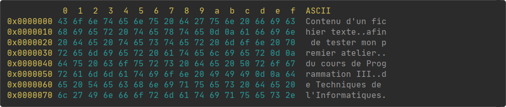

# Atelier 1

Cet atelier consiste à développer un programme, en ligne de commande, permettant d'afficher une suite de données d'un fichier.

## Fichier à accès aléatoire

Il sera nécessaire de manipuler des fichiers à accès aléatoire, et par conséquent, il faudra aussi gérer les exceptions qui pourraient se produire. Les classes ci-dessous doivent donc être importées :

```java
import java.io.IOException;
import java.io.RandomAccessFile;
```

Le constructeur de la classe « RandomAccessFile » permet d'ouvrir un fichier selon un mode, en lecture seule dans ce contexte :

```java
RandomAccessFile file = new RandomAccessFile("fileName.ext", "r");
```

La classe « RandomAccessFile » offre des méthodes afin de manipuler les données d'un fichier à accès aléatoire :

Méthode         | Description
----------------|-------------------------------------------------------------
void close()    | Fermeture de fichier.
long length()   | Obtention de la taille, en octets, du fichier.
int read()      | Obtention de l'octet à la position actuelle dans le fichier.
void seek(long) | Positionnement dans le fichier à l'octet passé en paramètre.

## Procédures

La procédure principale devra récupérer les arguments possibles :

- -o (facultatif, valeur par défaut : 0)
- -l (facultatif, valeur par défaut : taille du fichier - le décalage)
- -f (obligatoire)

Elle devra aussi les valider :

- La valeur du décalage (-o) doit être >= 0 et < que la taille du fichier.
- La valeur de la taille (-l) doit être > 0 et < que la taille du fichier - le décalage.
- La valeur du nom du fichier (-f) doit être valide.

```java
public static void main(String[] args) {
  // TODO: Gestion des arguments.
  // TODO: Gestion du fichier.
}
```

Si les arguments sont valides et le fichier ouvert, la procédure « printData » doit être appelée afin d'afficher les données demandées :

```java
public static void printData(RandomAccessFile file, long offset, long length) throws IOException {
  // TODO: Affichage des données.
}
```

```java
public static void printUsage() {
  // TODO: Affichage des indications.
}
```

## Arguments

Il est possible de passer des paramètres lors de l'exécution d'un programme, ce que l'on nomme des arguments. Sous l'éditeur « IntelliJ IDEA », les arguments peuvent être spécifiés en éditant la configuration de compilation :


La procédure principale comporte un paramètre « args », qui consiste en un tableau de chaînes de caractères, dans lequel sont stockés automatiquement les arguments passés au programme. Il serait possible de les afficher de cette façon :

```java
public static void main(String[] args) {
  for (int i = 0; i < args.length; i++)
    System.out.println(args[i]);
}
```

## Exemples

À partir d'un fichier texte nommé « texte.txt » ayant comme contenu :

```
Contenu d'un fichier texte
afin de tester mon premier atelier
du cours de Programmation III
de Techniques de l'Informatiques.
```

Le résultat avec l'argument « -f texte.txt » sera :



Le résultat avec les arguments « -o 75 -l 18 -f texte.txt » sera :


Et le résultat avec les arguments « -o 98 -l 28 -f texte.txt » sera :


*Il est à noter, dans la section ASCII, que les caractères de contrôle (les sauts de ligne par exemple) doivent être remplacés par le caractère « . ».*

## Couleurs

Il est possible, en ligne de commande, de modifier la couleur d'affichage des caractères à l'aide d'une balise spéciale :

```java
System.out.println("\u001B[33m Jaune");
System.out.println("\u001B[36m Cyan");
System.out.println("\u001B[37m Blanc");
```