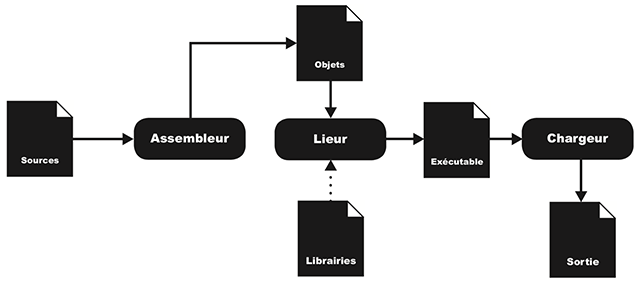
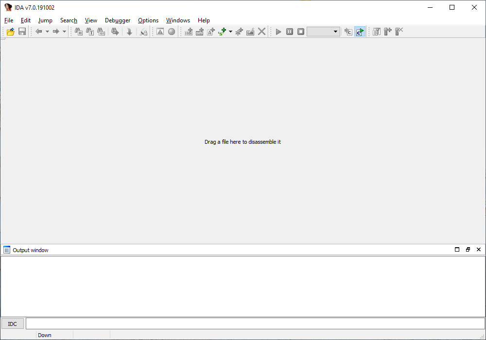
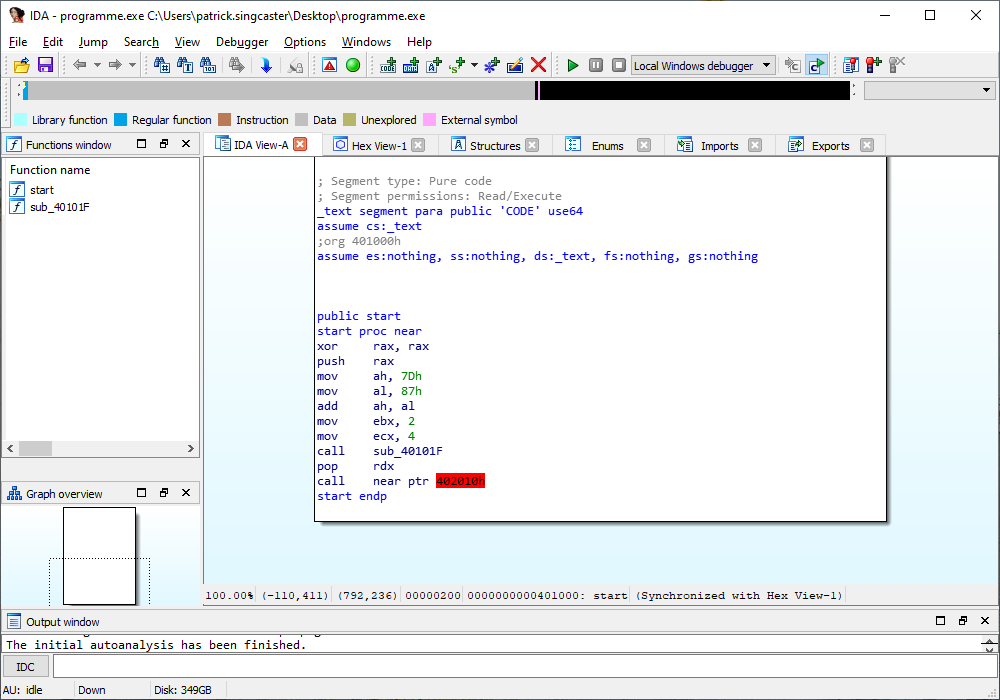
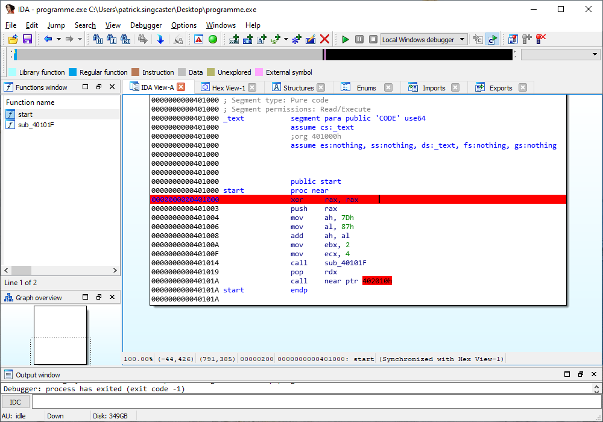
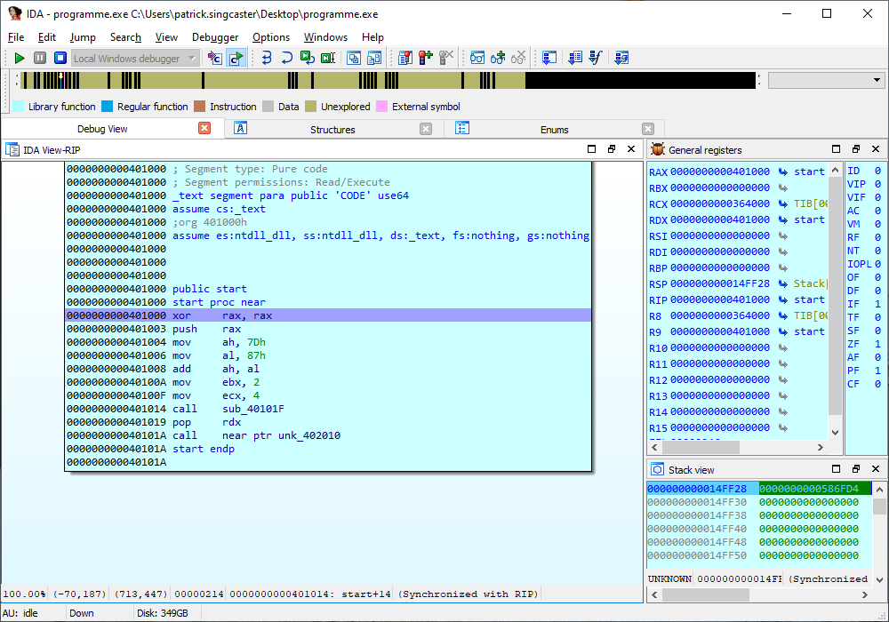
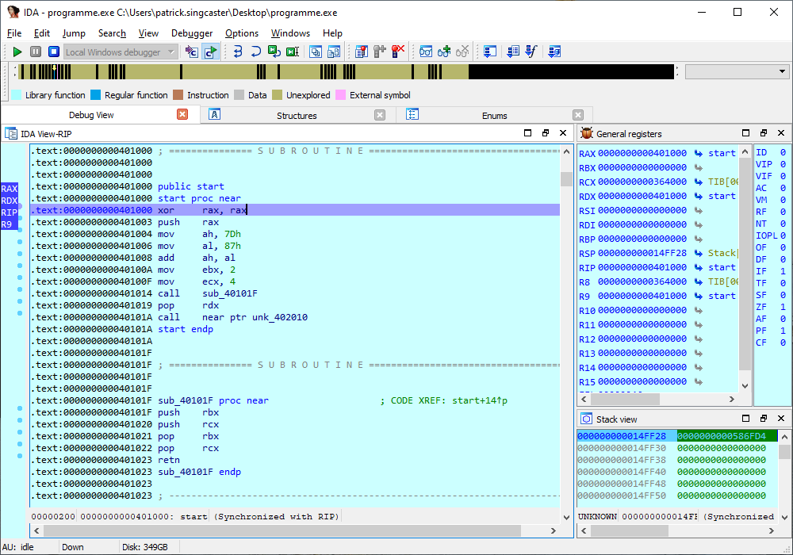

# Exécution d’un programme

L’atelier consiste à expérimenter l’exécution d’un programme, en mémoire centrale, par le système d'exploitation et le processeur.

## Prérequis

Les logiciels suivants, tous gratuits, sont nécessaires à la réalisation de cet atelier :

- NASM : https://nasm.us/<br>
- GoLink : http://www.godevtool.com/ *(pour les plateformes Windows uniquement)*<br>
- IDA : https://www.hex-rays.com/products/ida/support/download_freeware/

## Source

Le code minimal d’un programme en langage Assembleur :

### Windows 64 bits

```Assembly
extern ExitProcess ; Déclaration de la fonction Windows pour mettre fin au processus.
global Start       ; Déclaration de la fonction principale du programme.

section .text      ; Section de code du programme.
Start:             ; Point d'entré du programme.
                   ; Code source du programme.
  call ExitProcess ; Appel du système d'exploitation.
```

### MacOS

```Assembly
global _main          ; Déclaration de la fonction principale du programme.

section .text         ; Section de code du programme.
_main:                ; Point d'entré du programme.
                      ; Code source du programme.
  mov rax, 0x02000001 ; Numéro de fonction pour la fin du programme.
  xor rdi, rdi        ; Initialisation de la valeur de retour à 0.
  syscall             ; Appel du système d'exploitation.
```

### Linux

```Assembly
global start   ; Déclaration de la fonction principale du programme.

section .text  ; Section de code du programme.
start:         ; Point d'entré du programme.
               ; Code source du programme.
  mov rax, 60  ; Numéro de fonction pour la fin du programme.
  xor rdi, rdi ; Initialisation de la valeur de retour à 0.
  syscall      ; Appel du système d'exploitation.
```

### DOS

```Assembly
bits 16     ; Programme 16 bits.
org 100h    ; Allocation de la pile.
            ; Code source du programme.
mov ah, 4Ch ; Numéro de fonction pour la fin du programme.
int 21h     ; Appel du système d'exploitation.
```

## Processus

Processus de conversion du code assembleur, en code machine, et de création du fichier exécutable :



### Windows 64 bits

```
nasm -f win64 programme.asm -o programme.obj
GoLink /entry:Start /console kernel32.dll programme.obj
```

### MacOS

```
nasm -f macho64 programme.asm -o programme.obj
ld programme.obj -o programme -lSystem
```

### Linux

```
nasm -f elf64 programme.asm -o programme.obj
ld programme.obj -o programme
```

### DOS

```
nasm programme.asm -o programme.exe
```

## Atelier

L'exécution, du programme ci-dessous, doit être analysé ligne par ligne :

```Assembly
; En-tête du programme.

; Point d'entré du programme
  xor rax, rax
  push rax

  mov ah, 125
  mov al, 135
  add ah, al

  mov rbx, 2
  mov rcx, 4
  call Swap

  pop rdx

  ; Point de sortie du programme

Swap:
  push rbx
  push rcx
  pop rbx
  pop rcx

  ret
```

## Débogage

IDA est un outil de rétro-ingénierie que nous utiliserons comme débogueur :



Un programme exécutable peut être chargé à l'aide d'un glisser et déposer, ou de l'icône de la barre d'outils, ou du menu principal :



Un point d'arrêt peut-être appliqué sur une ligne à l'aide du menu contextuel :



Le débogage peut maintenant démarrer, et les fenêtres (Code, Registres et Pile) peuvent être disposées afin de consulter que les informations nécessaires à la réalisation de cet atelier :



Dans le cadre de cet atelier, il est préférable de passer en vision texte à l'aide du menu contextuel de la fenêtre d'instructions :



## Questions

- Que se passe-t-il suite à l'exécution de la ligne 6?
- Quel registre est affecté peu importe l'instruction exécutée et pourquoi?
- Quel autre registre est affecté suite à l'instruction de la ligne 7?
- Est-ce que le résultat de l'instruction à la ligne 11 est valide et comment pouvons-nous nous en assurer?
- Que se passe-t-il avec les valeurs des registres BX et CX suite aux instructions 22, 23, 24 et 25 et pourquoi?
- Quel registre est affecté à notre insu lors de l'exécution de l'instruction à la ligne 15?
- Quelle est la principale utilité de la pile des programmes exécutés en mémoire centrale?
