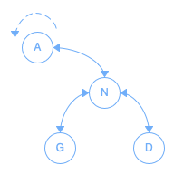

# Arbre binaire de recherche A.V.L.

L'arbre A.V.L. a exactement les mêmes fonctionnalités et utilités que l'arbre binaire de recherche, mais il vient pallier le défaut de performance que ce dernier peut avoir.

## Performance

Puisqu'il n'est pas possible de connaître d'avance dans quel ordre les données seront ajoutées dans un arbre binaire de recherche, la performance de recherche ne peut donc pas être garantie.

Par exemple, si l'on ajoute, dans l'ordre, les données suivantes à un arbre binaire de recherche:

*[Image]*

Nous pouvons remarquer que cette structure de donnée devient inutile puisqu'une simple liste offrirait la même performance de recherche.

## Équilibre

L'arbre A.V.L. vient ajouter un mécanisme d'équilibrage afin de s'assurer de l'optimalité de la performance des recherches.

En reprenant l'exemple précédent, mais avec un Arbre A.V.L.:

*[Image]*

Nous pouvons constater la grande amélioration de la structure des données pour la recherche.

### Rotations

L'équilibrage se fait via des rotations sur des noeuds.



Pour une rotation vers la gauche à partir du noeud (A):

- L’enfant de droite (N) devient la nouvelle racine.
- L’enfant de gauche (G), de la nouvelle racine (N), devient l’enfant de droite de l’ancienne racine (A).
- L’ancienne racine (A) devient l’enfant de gauche de la nouvelle racine (N).

### Indice d'équilibre

Pour s'assurer de la performance de recherche, un indice d'équilibre sera calculé pour chacun des noeuds parcourus lors de l'ajout dans l'arbre:

```
Indice d'équilibre = Hauteur du sous-arbre de droite - Hauteur du sous-arbre de gauche
```

Et selon certains résultats, des opérations devront être effectuées:

- (-2): Rotation vers la droite
- (2): Rotation vers la gauche

#### Exception

Il y a une exception à gérer dans deux contextes bien précis:

- Indice d'équilibre (-2) et indice d'équilibre de l'enfant (1): Double-rotation gauche-droite.
- Indice d'équilibre (2) et indice d'équilibre de l'enfant (-1): Double-rotation droite-gauche.