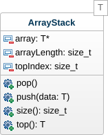

# Pile #

- Type : L.I.F.O. (Last-In, First-Out)
- Accès : Dessus
- Fonctionnalités : Empiler et Dépiler

## Statique ##

L'implémentation statique permet d'utiliser une pile dont la taille est fixe en mémoire centrale.

### UML ###



### Implémentation ###

```cpp
#include <cstdlib>

template <typename T>
class ArrayStack {
private:
  T* array;           ///< Tableau des données de la pile
  size_t arrayLength; ///< Taille du tableau de la pile
  size_t topIndex;    ///< Indice du dessus de la pile dans le tableau
  
public:
  ///\param length Taille du tableau de la pile
  ArrayStack(size_t length) {
    topIndex = 0;
    array = new T[length];
    arrayLength = length;
  }

  ~ArrayStack() {
    delete[] array;
  }

  ///\brief Empiler sur la pile
  ///\param data Donnée à empiler
  void push(T data) {
    if (topIndex < arrayLength)
      array[topIndex++] = data;
  }

  ///\brief Dépiler du dessus de la pile
  void pop() {
    if (topIndex)
      topIndex--;
  }

  ///\brief Dessus de pile
  ///\return Valeur au dessus de pile
  T top() {
    return (topIndex) ? array[topIndex - 1] : NULL;
  }

  ///\brief Compte de données
  ///\return Nombre de données dans la pile
  size_t size() {
    return topIndex;
  }
};
```