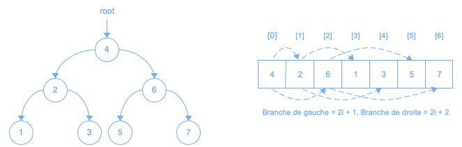
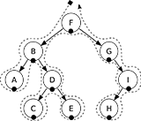
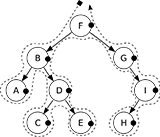

# Arbre binaire de recherche

Les données d'un arbre binaire de recherche sont uniques, comparables, et ordonnées d'une façon bien précise :

## Ajout

Lors de l'ajout, la nouvelle donnée devra être stockée dans une nouvelle feuille. Et pour se rendre à la position du nouveau noeud, la branche de gauche doit être empruntée si la nouvelle donnée est plus petite que la donnée du noeud parcouru, sinon la branche de droite sera empruntée.

## Recherche

La recherche s'effectue tout comme l'ajout. Mais plutôt que de créer un nouveau noeud, celle-ci retourne un booléen afin d'indiquer si la donnée est présente ou non dans l'arbre binaire de recherche.

## Retrait

Trois cas peuvent se présenter lors du retrait d'un noeud dans un arbre binaire de recherche :

### Feuille

- Mettre à nullptr la branche du parent.
- Libérer le noeud à retirer.

### Une branche

- Faire pointer la branche du parent vers l'enfant du noeud à retirer.
- Libérer le noeud à retirer.
  
### Deux branches

- Trouver la plus grande donnée du sous-arbre de gauche, ou la plus petite donnée du sous-arbre de droite, du noeud à retirer.
- Retirer cette donnée de l'arbre.
- Remplacer la donnée du noeud à retirer par la plus grande, ou plus petite, donnée préalablement trouvée.

## Parcours

Un parcours consiste à lister toutes les données d'une structure. Mais puisque dans un arbre binaire il y a toujours 2 possibilités par noeud, l'ordre des données dans le parcours peut être différent:

### Préfixe

- Ajouter la donnée du noeud courant au parcours.
- Diriger le noeud courant vers la branche de gauche s'il y a.
- Diriger le noeud courant vers la branche de droite s'il y a.

### Infixe

- Diriger le noeud courant vers la branche de gauche s'il y a.
- Ajouter la donnée du noeud courant au parcours.
- Diriger le noeud courant vers la branche de droite s'il y a.

### Postfixe

- Diriger le noeud courant vers la branche de gauche s'il y a.
- Diriger le noeud courant vers la branche de droite s'il y a.
- Ajouter la donnée du noeud courant au parcours.
