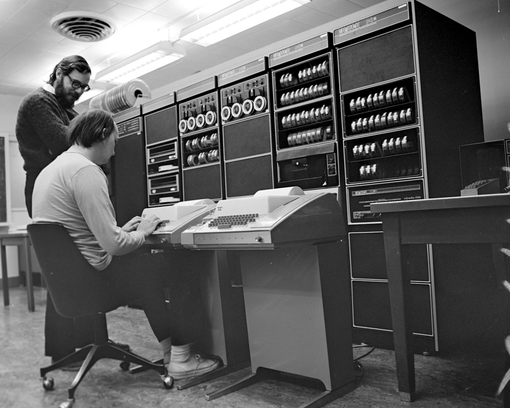

Langage de programmation structuré, mais de bas niveaux, permettant de manipuler dynamiquement les espaces mémoire avec des pointeurs, offrant des types primitifs, et très performant grâce à une implémentation de ses compilateurs près du processeur.

# Historique #

En 1969, dans les laboratoires de Bell, Ken Thompson développe un système d'exploitation qui deviendra le très célèbre UNIX.

Développé en Assembleur, le système d'exploitation devient difficile à maintenir et à faire évoluer. Thompson, ne trouvant pas d'alternatives existantes viables, conçut, avec l'aide de Denis Ritchie, le langage B. Mais celui-ci n'aboutit pas convenablement pour la réécriture du système UNIX. En 1971, Denis Ritchie entreprit donc de faire évoluer le langage B, pour devenir le langage C.



AT\&T, principal commanditaire des laboratoires Bell, oeuvrait dans le domaine des systèmes téléphoniques et, à l'époque, une loi lui interdisait de commercialiser autre chose. Ainsi, en 1975, le système d'exploitation UNIX complet, incluant son code source, fut distribué dans les universités à des fins éducatives.

C'est ainsi que le langage C devint l'un des plus utilisés dans le domaine des technologies de l'information.

# Sources #

Le code source d'un programme en langage C est stocké dans des fichiers textes ayant, habituellement, « .c » comme extension.

## Commentaires ##

Tout ce qui suit les caractères « // » sur une ligne est ignoré par le compilateur :

```C
// Commentaire sur une ligne.
```

Tout ce qui est encadré des balises « /* » et « */ » est aussi ignoré par le compilateur :

```C
/* Commentaire
   entre
   balises. */
```

## Blocs ##

Un bloc d'instructions est initié par une accolade ouvrante et terminé par une accolade fermante :

```C
{ // Début du bloc d'instructions.
  // Contenu du bloc d'instructions.
} // Fin du bloc d'instructions.
```

## Point d'entré ##

La procédure, ou fonction, identifiée « main » est le point de d'entré d'un programme en langage C :

```C
// Procédure principale.
void main() {
  // Instructions de la procédure principale.
}
```

La fonction principale permet de retourner une valeur entière au système d'exploitation :

```C
// Fonction principale.
int main() {
  // Instructions de la fonction principale.

  return 0;
}
```

La fonction principale peut aussi recevoir des paramètres :

```C
// Fonction principale avec paramètres.
int main(int argc, char *argv[]) {
  // Instructions de la fonction principale.

  return 0;
}
```

# Macros

Ces instructions sont toutes précédées du caractère « # » et sont exécutées avant la compilation.

## 4.1 Définitions

Sert régulièrement à déclarer des constantes, et agit comme un « rechercher-remplacer » :

```c
#define false 0
#define true 1
```

Ainsi, tous les termes « false » seront remplacés par 0 et tous les termes « true » seront remplacés par 1, avant la compilation.

## 4.2 Inclusions

Agit comme un « copier-coller » :

```c
#include <stdbool.h>
```

Ainsi, le code nécessaire sera copié du fichier « stdbool.h » et collé à l'endroit du « #include » avant la compilation.

*Par exemple, pour utiliser des variables booléennes dans un projet, il faut définir le type (typedef) « bool », et définir (#define) les constantes « false » et « true ». Ces définitions ont plutôt été placées dans un fichier d'en-tête « stdbool.h », permettant ainsi de seulement l'inclure (#include) dans les projets nécessitant l'utilisation de booléens.*

# Types #

Le langage C offre quelques types primitifs :

|Type   |Langage C|Taille               |Littéral                |
|-------|---------|---------------------|------------------------|
|Entier |char     |1 octet              |42 et '*'               |
|       |short    |2 octets             |32767                   |
|       |int      |4 octets             |2147483647              |
|       |long     |8 octets             |9223372036854775807     |
|Réel   |float    |4 octets             |3.1415926               |
|       |double   |8 octets             |3.141592653589793       |

Il est possible de préciser, pour les types entiers, que les valeurs peuvent qu'être positives, permettant de représenter de plus grandes valeurs :

|Langage C     |Taille  |Litéral             |
|--------------|--------|--------------------|
|unsigned char |1 octet |255                 |
|unsigned short|2 octets|65534               |
|unsigned int  |4 octets|4294967294          |
|unsigned long |8 octets|18446744073709551614|

# Définitions de type

L'identificateur de certains types n'est parfois pas assez révélateur au niveau du type de donnée et de sa taille. Il est possible de créer des alias de ces types :

```c
typedef char byte;
```

*Même s'il s'agit du même type de données, la taille est plus claire, et il est plus simple de différencier les valeurs entières (en utilisant « byte ») des valeurs caractères (en utilisant « char »).*

# Variables #

Les variables représentent des espaces, en mémoire centrale, afin de pouvoir y stocker et y consulter des données.

## Identificateurs

Plutôt que d'utiliser les adresses physiques de la mémoire centrale pour accéder aux données, il est possible de « nommer » les variables à l'aide d'un identificateur. Mais quelques contraintes s'appliquent à la composition de ceux-ci :

- Doivent débuter par une lettre ou le caractère '_'.
- Doivent contenir que des lettres, des chiffres, et des caractères '_'.
- Doivent être différents des mots-clés du langage C.

## Tableaux ##

...

### Chaîne de caractères ###

Une chaîne de caractères est en réalité un tableau de caractères :

```C
char chaine[18] = "Bonjour le monde!";
```

Il est à noter qu'une chaîne de caractères doit toujours se terminer par le caractère « NULL », soit la valeur 0, d'ou la case supplémentaire du tableau.

## Pointeurs ##

...

# Structures conditionnelles #

## Si ##

```C
if (proposition) {
  instructionA();
  instructionB();
  // ...
}
```

### Sinon ###

```C
if (proposition) {
  instructionA();
  instructionB();
  // ...
}
else {
  instructionC();
  instructionD();
  // ...
}
```

#### Ternaire ####

```C
(proposition) ? instructionA() : instructionB();
```

```C
valeurA = (proposition) ? valeurB : valeurC;
```

# Structure de routage #

```C
switch (valeur) {
  case valeurA:
    instructionA();
    break;
  case valeurB:
    instructionB();
  case valeurC:
    instructionC();
    break;
  default:
    instructionD();
}
```

# Structures itératives #

```C
while (proposition) {
  instructionA();
  instructionB();
  /// ...
}
```