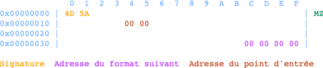

En programmation système, ce sont principalement des fichiers exécutables qui sont produits.

# Processus

Voici le processus, du code source à l'exécution, d'un programme exécutable :

# Formats

Chaque système d'exploitation a son propre format de fichier exécutable.

## M.Z.

Le format « Mark Zbikowski » est utilisé par le système d'exploitation DOS.

*Il est aussi utilisé par Window pour encapsuler son format d'exécutable, par souci de rétrocompatibilité, d'où l'adresse du format suivant.*

## P.E.

Le format « Portable Executable » est utilisé par le système d'exploitation Windows.

*Les premières versions du système d'exploitation Windows n'étaient qu'une interface graphique par-dessus le système d'exploitation DOS. Par contre, il fallait différencier les programmes graphiques des programmes console, d'où le message d'erreur dans le format MZ.*

## E.L.F.

Le format « Executable And Linkable Format » est utilisé par le système d'exploitation Linux.

## Mach-O

Le format « Mac Object » est utilisé par le système d'exploitation macOS.

# Chargement

Avant son exécution, le système d'exploitation charge le programme en mémoire centrale et le structure en plusieurs sections :

# Exemple

