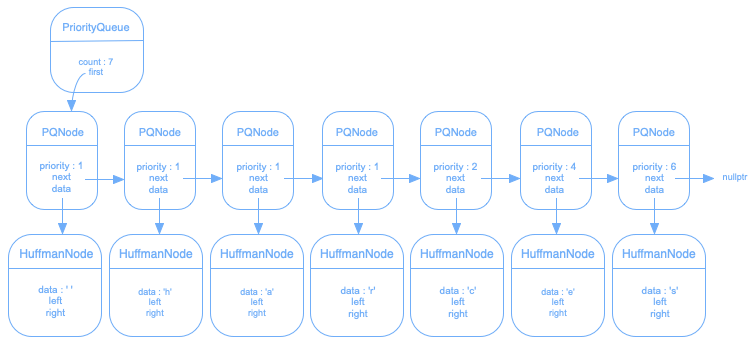
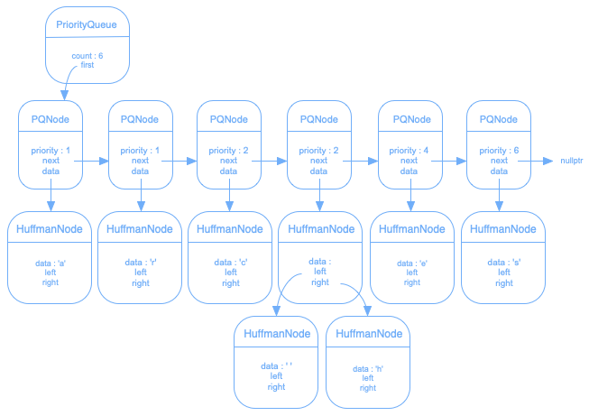
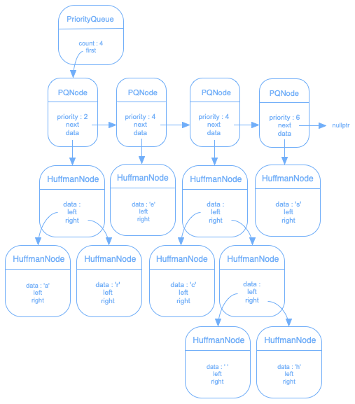
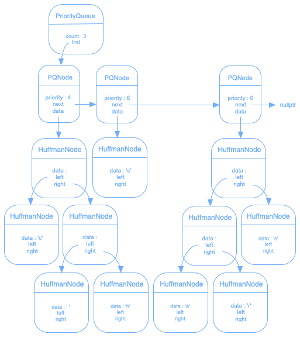

# Encodage de Huffman

Le codage de Huffman permet à la fois de chiffrer des données et de les compresser sans perte.

Les étapes du codage semi-adaptatif sont démontrées ci-dessous selon la chaîne de caractères : « **ces chasseresses** ».

## Recensement

La première étape consiste à calculer l'occurrence de chacun des caractères :

```
  1
a 1
c 2
e 4
h 1
r 1
s 6
```

Ce recensement composera la clé permettant de chiffrer et de déchiffrer les données.

Les caractères seront stockés dans des noeuds de Huffman et leur occurrence permettra de stockés ces noeuds dans une file de priorité :



## Arbre

Les noeuds de Huffman dans la file de priorité permettront de construire l'arbre de Huffman en suivant les 3 étapes suivantes :

1. Tant que la file de priorité contient plus d'un noeud de Huffman, répéter les étapes 2 et 3.
2. Créer un nouveau noeud de Huffman ayant comme branches les deux premiers noeuds défilés de la file de priorité.
3. Enfiler le nouveau noeud avec comme priorité la somme des priorités des deux noeuds défilés.



Puisque la liste de priorité contient plus d'un noeud de Huffman, répéter les étapes 2 et 3 :


Puisque la liste de priorité contient toujours plus d'un noeud de Huffman, répéter les étapes 2 et 3 :



Puisque la liste de priorité contient encore plus d'un noeud de Huffman, répéter les étapes 2 et 3 :



Puisque qu'il reste encore plus d'un noeud de Huffman dans la file de priorité, répéter les étapes 2 et 3 :


Finalement, lorsque la file de priorité contient qu'un seul noeud de Huffman, il s'agira de la racine de l'arbre de Huffman. Nous pouvons donc déclarer une variable pointant sur ce noeud, et libérer la file de priorité :


## Encodage

Une fois l'arbre de Huffman construit, un parcours de cet arbre, toujours à partir de la racine, doit être effectué afin de déterminer l'encodage de chacun des caractères. Si le parcours se dirige vers la gauche (pointeur orange), un 0 est ajouté à l'encodage. Et si le parcours se dirige vers la droite (pointeur vert), un 1 est ajouté à l'encodage :


Donc, l'encodage de chacun des caractères serait :

```
  1010
a 1011
h 000
r 001
c 100
e 01
s 11
```

On peut remarquer que les caractères ayant une occurrence plus élevée ont un encodage contenant moins de bits, ce qui aura comme effet de compresser les données.

## Chiffrement

À partir de l'encodage, remplacer chacun des caractères, de la chaîne originale, par le code binaire :

```
1000111101010000010111111010010111110111
```

Ensuite, grouper ces bits par octet. Si des bits sont manquants pour former le dernier octet, ajouter des 0 à la fin comme bits de bourrages :

```
10001111 01010000 01011111 10100101 11110111
```

Et finalement, convertir en décimal chacun des octets :

```
143 80 95 165 247
```
