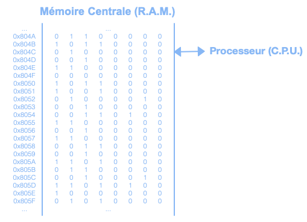
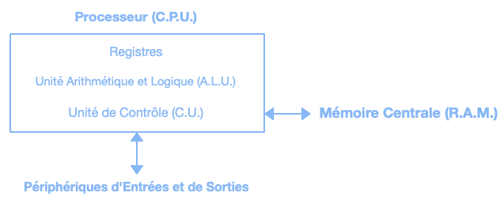
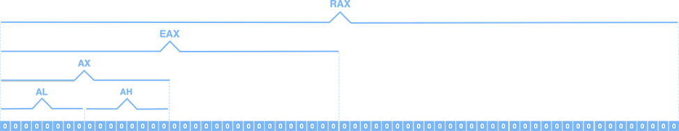
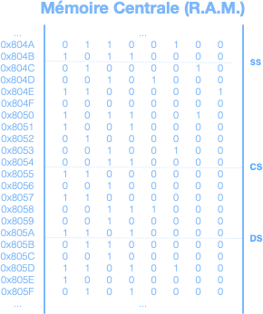
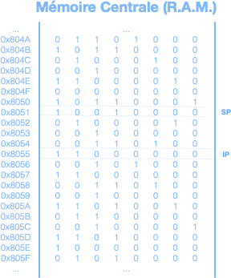

Unités système nécessaires à l'exécution d'un programme.

# Mémoire centrale

La mémoire centrale, ou mémoire vive, est la « mémoire à court terme » de l'ordinateur et son rôle est de lire et stocker les données lors des opérations du processeur.

Chaque octet de la mémoire centrale est associé à une adresse.

# Unité centrale de traitement

L'unité centrale de traitement, ou processeur, est le « cerveau » de l'ordinateur et son rôle est d'exécuter les opérations.

## Registres

Les registres sont des espaces mémoires particuliers auxquelles le processeur peut accéder directement, avec un très faible temps d'accès, puisqu'ils sont situés dans le processeur.

Les registres sont impliqués dans la quasi-totalité des instructions que le processeur peut accomplir. Leur nombre est très limité et leur taille est variable. 16 bits pour un processeur dit 16 bits, 32 bits pour un processeur dit 32 bits, 64 bits pour un processeur dit 64 bits, etc.

### Données

Parmi la quinzaine de registres qu'offrait le processeur 8086 d'Intel, 4 registres de 16 bits étaient disponibles pour usage courant. On nomme ces registres : AX, BX, CX et DX.

Les registres de données sont divisés en deux parties de 8 bits chacunes : la partie haute et la partie basse. AH et AL composent AX, BH et BL composent BX, etc. « H » étant la partie haute (High) et « L » la partie basse (Low).

Avec la venu des processeurs 32 bits, ces registres ont été nommé EAX, EBX, ECX et EDX afin de conserver une rétro-compatibilité avec les processeurs 16 bits. On a fait de même avec la venu des processeurs 64 bits en les nommant RAX, RBX, RCX et RDX.

Les registres de données peuvent être utilisés librement par le programmeur pour ses besoins, mais ils ont aussi un rôle spécifiques pour certaines instructions.

- AX sert régulièrement d’accumulateur pour stocker le résultat ou passer un paramètre.
- BX sert régulièrement à gérer l’adressage indexé en mémoire centrale.
- CX sert régulièrement à gérer des structures itératives.
- DX sert à quelques instructions mathématiques.

### Segments

Parmi les autres registres, 4 registres de segment servent à pointer les sections de mémoire où se trouvent les différentes parties d’un programme.

Le registre CS « Code Segment » pointe l’adresse du segment de mémoire qui contient les instructions du programme, DS « Data Segment », l’adresse du segment qui contient les données, SS « Stack Segment », l’adresse du segment de la pile.

### Pointeurs

D’autres registres servent aussi de pointeurs en mémoire centrale.

Le registre IP « Instruction Pointer » contient l’adresse-mémoire de la prochaine instruction à exécuter par le processeur et le registre SP « Stack Pointer » contient l’adresse-mémoire du dessus de la pile.

### Indicateurs

Le processeur a été conçu afin qu'il ne cesse jamais de fonctionner. Un mécanisme interne est donc nécessaire afin que le ou la programmeur puisse faire le suivi des opérations.

Un registre d'indicateurs « flags » est disponible à cet effet. Chacun de ses bits représente une particularité qui pourrait se produire suite à une opération.

- « OF (Overflow) » est vrai (1) s'il y a eu dépassement de capacité d'un registre lors de la dernière opération.
- « ZF (Zero Flag) » est vrai (1) si le résultat de la dernière opération est 0.
- « SF (Sign Flag) » est vrai (1) lorsque le signe change.
- ...

## Opérations

L'ensemble des instructions (Instruction Set) consiste à toutes les opérations (Operation Code) qu'un processeur peut exécuter.
