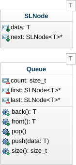

# File #

- Type : F.I.F.O. (First-In, First-Out)
- Accès : Devant et Derrière
- Fonctionnalités : Enfiler et Défiler

## Dynamique ##

L'implémentation dynamique permet d'utiliser une file sans limitation de taille puisque les données sont dynamiquement allouées et libérées en mémoire centrale.

### UML ###

### Implémentation ###

...