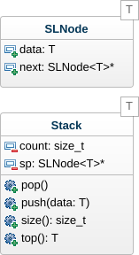

# Pile #

- Type : L.I.F.O. (Last-In, First-Out)
- Accès : Dessus
- Fonctionnalités : Empiler et Dépiler

## Dynamique ##

L'implémentation dynamique permet d'utiliser une pile sans limitation de taille puisque les données sont dynamiquement stockées en mémoire centrale.

### UML ###



### Implémentation ###

```cpp
#include <cstdlib>
#include "SLNode.hpp"

template <typename T>
class Stack {
private:
  size_t count;     ///< Nombre de données
  SLNode<T>* first; ///< Pointeur sur le premier noeud

public:
  Stack() {
    count = 0;
    first = nullptr;
  }

  ~Stack() {
    while (count)
      pop();
  }

  ///\brief Empiler au dessus de la pile
  ///\param data Donnée à empiler
  void push(T data) {
    first = new SLNode<T>(data, first);
    count++;
  }

  ///\brief Dépiler du dessus de la pile
  void pop() {
    if (count) {
      SLNode<T>* toDelete = first;
      first = first->next;
      delete toDelete;
      count--;
    }
  }

  ///\brief Dessus de la pile
  ///\return Valeur au dessus de la pile
  T top() {
    return (count) ? first->data : NULL;
  }

  ///\brief Compte de données
  ///\return Nombre de données dans la pile
  size_t size() {
    return count;
  }
};
```
