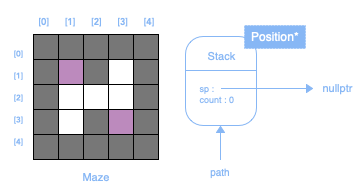

# Travail 1 #

La pile est régulièrement utilisée afin d'effectuer des retours en arrière : retour d'une fonction, annulation d'opérations, etc. Elle pourrait donc aussi être utilisée dans un algorithme de recherche de chemin.

## Labyrinthe ##

L'instance « maze » offre une méthode « getSquare(x, y) » qui retourne le type de case à la position passée en paramètre. Par exemple, si l'on désire vérifier si la case de la colonne 3 et de la ligne 5 est différente d'un mur :

```cpp
if (maze->getSquare(3, 5) != Square::WALL)
```

Le résultat peut uniquement être l'un de ces 4 types :

```cpp
Square::ENTRY // Entrée
Square::EXIT  // Sortie
Square::WALL  // Mur
Square::WAY   // Chemin
```

*Les labyrinthes utilisés seront toujours de 53 x 53 et auront toujours une entrée et une sortie.*

## Affichage ##
L'affichage du labyrinthe et de la position actuelle (toujours au-dessus de la pile) se fait dans la méthode « onRefresh() » de la classe « MazeSolver » :

```cpp
void onRefresh() {
  // TODO : Afficher le labyrinthe.
  // TODO : Afficher la position actuelle.
}
```

**La méthode « onRefresh() » est appelée AUTOMATIQUEMENT environ 60x par seconde. Elle doit donc contenir du code qui a UNIQUEMENT trait à l'affichage.**

Une méthode « drawSquare(Square, x, y) » est offerte pour afficher une case selon un type et une position passés en paramètre. Par exemple, si l'on désire afficher la position actuelle du programme dans le labyrinthe :

```cpp
drawSquare(Square::PATH, path->top()->x, path->top()->y);
```

## Résolution ##

Au départ (constructeur de la classe « MazeSolver »), une pile doit être instanciée, l'entrée doit être trouvée et une position instanciée à cet endroit. Les directions possibles de cette position doivent être déterminées, et cette position doit être empilée.

Par la suite, la méthode « onUpdate() » de la classe « MazeSolver » permettra d'effectuer un déplacement.

**La méthode « onUpdate() » est appelée AUTOMATIQUEMENT environ 60x par seconde. Elle doit donc contenir du code qui a trait à UN SEUL déplacement.**

À chaque appel, la situation sera l'une des 3 suivantes :

- **Une direction possible**<br>
Indiquer la direction empruntée dans la position actuelle, instancier une nouvelle position vers la direction empruntée, calculer ses directions possibles, indiquer la provenance et l'empiler.

- **Plusieurs directions possibles**<br>
Sélectionner au hasard une direction à emprunter parmi celles possibles, indiquer la direction empruntée dans la position actuelle, instancier une nouvelle position vers la direction, calculer ses directions possibles, indiquer sa provenance et l'empiler.

- **Aucune direction possible**<br>
Dépiler.

## Exemple ##

Supposons que le programme doit résoudre le labyrinthe suivant : 


En premier lieu, instancier une pile pour contenir le chemin parcouru :



Ensuite, trouver l'entrée, instancier une position avec les coordonnées de l'entrée, déterminer les directions possibles, et empiler l'instance de position :


La position en dessus de pile représente **toujours** la position actuelle du programme dans le labyrinthe. Et le tableau de booléens « dir » indique s'il est possible (T) d'aller vers le nord, vers le sud, vers l'est, et vers l'ouest.

À partir de l'a, le programme se retrouvera toujours dans l'une des 3 situations exposées dans la section résolution. Dans le cas présent, puisqu'il y a qu'une seule position possible, on met à faux la direction empruntée, on instancie une nouvelle position vers la direction, on calcule ses directions possibles, on met à faux la provenance, et on empile la nouvelle position :


Dans cette situation, il y a 2 possibilités, soit vers le sud, ou vers l'est. Nous devons sélectionner une direction au hasard, et s'y diriger en effectuant les mêmes opérations :


Dans cette situation, il n'y a aucune possibilité. Il s'agit du cas le plus simple, puisqu'il suffit de dépiler afin de revenir à la position précédente :


Et maintenant, il ne reste qu'une seule possibilité à cette position, nous devons donc nous y diriger en effectuant les mêmes opérations :


Et ainsi de suite, jusqu'à atteindre la sortie.

## Projets ##

La librairie graphique « SDL2 » doit préalablement être installée selon le prérequis « Outils de développement ».

- [Linux](Fichiers/420C35JOTP1LINUX.zip)
- [MacOS](Fichiers/420C35JOTP1MACOS.zip)
- [Windows](Fichiers/420C35JOTP1WINDOWS.zip)

## Barème ##

**Pile&nbsp;&nbsp;&nbsp;&nbsp;&nbsp;&nbsp;&nbsp;&nbsp;&nbsp;&nbsp;&nbsp;&nbsp;&nbsp;&nbsp;&nbsp;&nbsp;&nbsp;&nbsp;&nbsp;&nbsp;&nbsp;&nbsp;&nbsp;&nbsp;&nbsp;&nbsp;&nbsp;&nbsp;&nbsp;&nbsp;&nbsp;&nbsp;&nbsp;&nbsp;&nbsp;&nbsp;&nbsp;&nbsp;&nbsp;&nbsp;&nbsp;&nbsp;/ 6**<br>
Constructeur et destructeur&nbsp;&nbsp;&nbsp;&nbsp;/ 2<br>
Empiler et dépiler&nbsp;&nbsp;&nbsp;&nbsp;&nbsp;&nbsp;&nbsp;&nbsp;&nbsp;&nbsp;&nbsp;&nbsp;&nbsp;&nbsp;&nbsp;&nbsp;&nbsp;&nbsp;&nbsp;&nbsp;/ 3<br>
Dessus et compte&nbsp;&nbsp;&nbsp;&nbsp;&nbsp;&nbsp;&nbsp;&nbsp;&nbsp;&nbsp;&nbsp;&nbsp;&nbsp;&nbsp;&nbsp;&nbsp;&nbsp;&nbsp;&nbsp;&nbsp;/ 1<br>
**Position&nbsp;&nbsp;&nbsp;&nbsp;&nbsp;&nbsp;&nbsp;&nbsp;&nbsp;&nbsp;&nbsp;&nbsp;&nbsp;&nbsp;&nbsp;&nbsp;&nbsp;&nbsp;&nbsp;&nbsp;&nbsp;&nbsp;&nbsp;&nbsp;&nbsp;&nbsp;&nbsp;&nbsp;&nbsp;&nbsp;&nbsp;&nbsp;&nbsp;&nbsp;&nbsp;/ 2**<br>
Données membres&nbsp;&nbsp;&nbsp;&nbsp;&nbsp;&nbsp;&nbsp;&nbsp;&nbsp;&nbsp;&nbsp;&nbsp;&nbsp;&nbsp;&nbsp;&nbsp;&nbsp;&nbsp;/ 1<br>
Méthodes&nbsp;&nbsp;&nbsp;&nbsp;&nbsp;&nbsp;&nbsp;&nbsp;&nbsp;&nbsp;&nbsp;&nbsp;&nbsp;&nbsp;&nbsp;&nbsp;&nbsp;&nbsp;&nbsp;&nbsp;&nbsp;&nbsp;&nbsp;&nbsp;&nbsp;&nbsp;&nbsp;&nbsp;&nbsp;&nbsp;&nbsp;&nbsp;/ 1<br>
**Résolution&nbsp;&nbsp;&nbsp;&nbsp;&nbsp;&nbsp;&nbsp;&nbsp;&nbsp;&nbsp;&nbsp;&nbsp;&nbsp;&nbsp;&nbsp;&nbsp;&nbsp;&nbsp;&nbsp;&nbsp;&nbsp;&nbsp;&nbsp;&nbsp;&nbsp;&nbsp;&nbsp;&nbsp;&nbsp;&nbsp;&nbsp;/ 7**<br>
Une direction possible&nbsp;&nbsp;&nbsp;&nbsp;&nbsp;&nbsp;&nbsp;&nbsp;&nbsp;&nbsp;&nbsp;&nbsp;/ 1<br>
Plusieurs directions possibles&nbsp;/ 2<br>
Aucune direction possible&nbsp;&nbsp;&nbsp;&nbsp;&nbsp;&nbsp;/ 2<br>
Pas de chemin possible&nbsp;&nbsp;&nbsp;&nbsp;&nbsp;&nbsp;&nbsp;&nbsp;&nbsp;&nbsp;/ 1<br>
Affichage&nbsp;&nbsp;&nbsp;&nbsp;&nbsp;&nbsp;&nbsp;&nbsp;&nbsp;&nbsp;&nbsp;&nbsp;&nbsp;&nbsp;&nbsp;&nbsp;&nbsp;&nbsp;&nbsp;&nbsp;&nbsp;&nbsp;&nbsp;&nbsp;&nbsp;&nbsp;&nbsp;&nbsp;&nbsp;&nbsp;&nbsp;&nbsp;/ 1<br>
**Total&nbsp;&nbsp;&nbsp;&nbsp;&nbsp;&nbsp;&nbsp;&nbsp;&nbsp;&nbsp;&nbsp;&nbsp;&nbsp;&nbsp;&nbsp;&nbsp;&nbsp;&nbsp;&nbsp;&nbsp;&nbsp;&nbsp;&nbsp;&nbsp;&nbsp;&nbsp;&nbsp;&nbsp;&nbsp;&nbsp;&nbsp;&nbsp;&nbsp;&nbsp;&nbsp;&nbsp;&nbsp;&nbsp;/ 15**

\* *Des points seront retirés pour le gaspillage et les fuites de mémoire.*