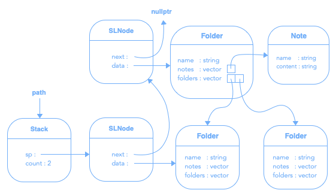

# Classeur #

Le dernier travail pratique en est un d'intégration dans lequel la pile dynamique, la file dynamique, la file de priorité dynamique, la liste statique et l'arbre binaire de recherche dynamique seront nécessaires :

```cpp
#include <string>
#include <vector>
#include "Stack.hpp"
#include "Queue.hpp"
// #include "PriorityQueue.hpp"
#include "BSTree.hpp"
// #include "AVLTree.hpp"
// #include "Huffman.hpp"

using namespace std;
```

## Arborescence ##

L'arborescence du classeur est constituée de dossiers pouvant contenir des sous-dossiers et des notes :


### Dossier ###

La classe « Folder » contient un nom et une liste statique pour chacun des types d'éléments qu'il peut contenir, soit des dossiers et des notes :


Nous utiliserons la liste statique du langage C++ nommée « vector ». En plus de pouvoir utiliser les méthodes « push_back » et « pop_back » afin d'ajouter et retirer un élément en fin de liste, la classe « vector » s'utilise exactement comme un tableau :

```cpp
folders.push_back(new Folder("Nom")); // Ajout d'un dossier « Nom » à la liste de dossiers
size_t count = folders.size();        // Obtention du nombre de dossiers dans la liste
Folder* dossier = folders[0];         // Obtention du premier dossier de la liste
folders.pop_back();                   // Retrait du dernier dossier de la liste
```

### Note ###

En plus d'un nom, une note devra aussi contenir du texte :


## Fenêtre ##

La classe « Window » comporte toutes les fonctionnalités afin de manipuler l'interface de l'application :


### Énumération ###

Deux énumérations sont disponibles afin d'identifier les icônes et les items de menu :


### Méthodes ###

Les méthodes que comporte la classe « Window » sont :

```cpp
/// \brief Obtention de la hauteur actuelle de la fenêtre
/// \return Hauteur, en pixels, de la fenêtre
int getHeight();

/// \brief Obtention de la largeur actuelle de la fenêtre
/// \return Largeur, en pixels, de la fenêtre
int getWidth();

/// \brief Obtention de la hauteur d'un icône
/// \return Hauteur, en pixels, d'un icône
int getIconHeight();

/// \brief Obtention de la largeur d'un icône
/// \return Largeur, en pixels, d'un icône
int getIconWidth();

/// \brief Définition du titre de la fenêtre
/// \param title Titre de la fenêtre
void setTitle(const char* title);

/// \brief Affichage d'un icône dans la fenêtre
/// \param icon Icône à afficher
/// \param x Position, en pixels, sur l'axe des x
/// \param y Position, en pixels, sur l'axe des y
/// \param selected Si l'icône est sélectionné
void drawIcon(const Icon& icon, const int& x, const int& y, const bool& selected = false);

/// \brief Affichage d'une chaîne de caractères dans la fenêtre
/// \param text Chaîne de caractères à afficher
/// \param x Position, en pixels, sur l'axe des x
/// \param y Position, en pixels, sur l'axe des y
void drawString(const string& text, const int& x, const int& y);

/// \brief Obtention de la largeur, en pixels, d'une chaîne de caractères
/// \param text Chaîne de caractères à obtenir la largeur
/// \return Largeur, en pixels, de la chaîne de caractères
int getStringWidth(const char* text);

/// \brief Affichage du menu contextuel
/// \param x Position, en pixels, sur l'axe des x
/// \param y Position, en pixels, sur l'axe des y
/// \param enables Éléments disponibles du menu
void showMenu(const int& x, const int& y, const unsigned int& enables = 0);

/// \brief Affichage d'un champ texte
/// \param text Contenu du champ texte
/// \return Contenu dans le champ texte
string showTextField(const string& text = "");
```

### Événements ###

L'implémentation de toutes les fonctionnalités se fera dans le fichier « TP5.hpp » et celui-ci contient cinq fonctions appelées automatiquement lors d'événements :

```cpp
/// \brief Automatiquement appelée lorsque la fenêtre s'ouvre
void onInit() {
  // TODO : Initialisations
}

/// \brief Automatiquement appelée environ 60 fois par seconde
void onRefresh() {
  // TODO : Afficher le contenu du dossier actuel
}

/// \brief Automatiquement appelée lors d'un click de souris dans la fenêtre
/// \param x Position, en pixels, sur l'axe des x
/// \param y Position, en pixels, sur l'Axe des y
/// \param button Bouton clické
/// \param ctrl Si la touche « Ctrl » est enfoncée
void onWindowClick(const int& x, const int& y, const bool& button, const bool& ctrl) {
  if (button) { // Bouton de gauche
    // TODO : Click sur un dossier ou une note du dossier actuel
  }
  else { // Bouton de droite
    // TODO : Afficher le menu
  }
}

/// \brief Automatiquement appelée lors d'un click de souris dans le menu contextuel
/// \param menu Élément de menu clické.
void onMenuClick(const unsigned int& menuItem) {
  switch (menuItem) {
  case Menu::NEW_FOLDER:
    // TODO : Créer un nouveau dossier dans le dossier actuel
    break;

  case Menu::NEW_NOTE:
    // TODO : Créer une nouvelle note dans le dossier actuel
    break;

  case Menu::RENAME:
    // TODO : Renommer le dossier ou la note sélectionnée
    break;

  case Menu::DELETE:
    // TODO : Supprimer les dossiers, et tout ce qu'ils contiennent, et les notes sélectionnés
    break;

  case Menu::ENCODE:
    // TODO : Encoder la note sélectionnée avec la méthode de Huffman
    break;

  case Menu::DECODE:
    // TODO : Décoder la note sélectionnée avec la méthode de Huffman
    break;

  case Menu::SELECT_ALL:
    // TODO : Sélectionner tous les dossiers et les notes du dossier actuel
    break;
  }
}

/// \brief Automatiquement appelée lorsque la fenêtre se ferme
void onQuit() {
  // TODO : Libérations
}
```

## Interface ##

L'interface utilisateur sera principalement constituée d’icônes et de chaînes de caractères :


La présentation de ces éléments devra :

- Afficher les dossiers en premier, suivis des notes.
- Afficher le nom centré sous l'icône et s'il est trop long, le tronquer et compléter par des points de suspension.
- Trier les titres, à l'aide du tri rapide, en ordre alphabétique.
- Ajuster la position des éléments afin de profiter de tout l'espace disponible, sans défilement vertical.
- Titrer la fenêtre selon le chemin complet de la position actuelle dans l'arborescence.
- Afficher un menu contenant les actions possibles en limitant leur utilisation qu'à celles qui sont applicables.

Et l'interface devra permettre de :

- Naviguer à l'intérieur du classeur.
- Sélectionner, créer, renommer et supprimer des dossiers et des notes.
- Éditer, encoder et décoder des notes.

### Navigation ###

On doit pouvoir naviguer dans le classeur à l'aide des dossiers, ou modifier des notes, avec un click sur le bouton de gauche de la souris.

#### Indice ####

Mais d'abord, il faut identifier quel élément a été clické. Pour ce faire, une fonction « getIndex », dans le fichier « TP5.hpp », sera nécessaire :

```cpp
/// \brief Obtention de l'indice de l'élément clické
/// \param x Position de la souris, en pixels, sur l'axe des x
/// \param y Position de la souris, en pixels, sur l'axe des y
/// \return Indice de l'élément
int getIndex(const int& x, const int& y) {
  // TODO : Retourner l'indice de l'élément clické
}
```

Cette fonction doit transformer en indice la position du click sur l'axe des x et des y, à l'aide de la hauteur de la fenêtre, de la largeur de la fenêtre, ainsi que de la hauteur des icônes et de la largeur des icônes :


Si l'indice est plus grand ou égal à la somme du nombre de dossiers et de notes, c'est que le click est sur aucun élément. Sinon, si l'indice est plus petit que le nombre de dossiers, c'est qu'un dossier a été clické, sinon c'est une note qui a été clické.

Si un dossier a été clické, l'indice permet de l'accéder dans la liste de dossiers. Si c'est une note qui a été clické, l'indice moins le nombre de dossiers permet de l'accéder dans la liste de notes.

#### Parent ####

Un dossier « .. » permet de revenir au dossier parent. Le dossier « .. » doit toujours être affiché en premier, sauf pour la racine ou il n'est pas présent, et est virtuel, c’est-à-dire qu’il ne doit pas faire partie de l'arborescence, ne peut être sélectionné, ni être supprimé.

#### Chemin ####

Le chemin sera contenu dans une pile dynamique. Un pointeur sur le dossier clické doit être empilé, et un dépilement doit être effectué lorsque le dossier « .. » est clické. C'est donc dire qu'un dossier racine doit être empilé au démarrage de l'application et que le dessus de la pile pointera toujours sur l'emplacement actuel dans le classeur :



### Nouveau / Renommer ###

La création de dossier ou de note nécessite un nom saisi par l'utilisateur dans un champ texte. Dans le cas où le nom fourni par l'utilisateur est vide, l'action est annulée. Il en va de même si un autre élément de même type porte le même nom.

Lors d'un renommage, le champ texte doit contenir le nom actuel de l'élément à renommer.

### Sélection / Désélection ###

Lors d'un clic sur un élément avec le bouton de gauche de la souris et la touche « Ctrl » de gauche du clavier enfoncée, celui-ci est ajouté ou retiré de ceux déjà sélectionnés.

Une option du menu permet aussi de sélectionner tous les éléments. Et afin de désélectionner tout, il suffit de cliquer, avec le bouton de gauche de la souris, à un endroit sans éléments. Bien sûr, lors de l'entrée dans un dossier ou à l'édition d'une note, tous les éléments sont automatiquement désélectionnés.

Les sélections sont en fait que les indices des éléments stockés dans un arbre binaire de recherche afin de trouver rapidement si un élément est sélectionné ou non :


### Supression ###

Tous les éléments sélectionnés doivent être supprimés. Pour ce faire, il faut un parcours infixe inversé de l'arbre de sélection et supprimer chaque élément selon les indices du parcours.

### Encodage / Décodage ###

L'action « Encoder » est applicable seulement sur une note. Elle permet d'encoder le contenu avec la méthode de Huffman. Le contenu d’une note encodé doit être inaccessible par l'utilisateur.

L’action « Décoder » est applicable seulement sur une note déjà encodé. Elle permet de rétablir le contenu de la note.

### Chargement / Sauvegarde ###

Le classeur, afin de pouvoir être utilisé ultérieurement, est sauvegardé dans un fichier sur un support de mémoire auxiliaire.

Lors de l'ouverture de l'application, le classeur sera automatiquement importé de ce fichier, et lors de la fermeture, le classeur sera sauvegardé dans ce même fichier.

Voici un exemple de ce que pourrait être un fichier texte représentant un classeur :

```
<F Dossier>
<F Sous‐dossier>
<N Autre note>
Contenu autre note
</N>
</F>
<N Note avec un nom trop long>
Contenu note avec un nom trop long
</N>
</F>
<H Fichier encode>
143 80 95 165 247
</H>
```

# Projets #

Projets de base selon l'environnement de développement et le système d'exploitation :

- [Visual Code sous Linux](Fichiers/TP5VCLinux.zip)
- [Visual Code sous MacOS](Fichiers/TP5VCMacOS.zip)
- [XCode sous MacOS](Fichiers/TP5XC.zip)
- [Visual Code sous Windows](Fichiers/TP5VCWindows.zip)
- [CLion sous Windows](Fichiers/TP5CLWindows.zip)
- [Visual Studio sous Windows](Fichiers/TP5VS.zip)

# Barème #

**Affichage / 6**<br>
Affichage du chemin / 1<br>
Ajustement lors de redimension / 1<br>
Centrage et tronquage des titres sous les icônes / 2<br>
Dossiers suivis des notes triés (rapidement) en ordre alphabétique / 2<br>

**Navigation / 7**<br>
Click sur dossier, dossier parent, et note / 3<br>
Sélections, et désélections d'éléments / 2<br>
Gestion du menu contextuel / 2<br>

**Opérations / 6**<br>
Création, renommage et suppression d’éléments / 5<br>
Modification du contenu de note / 1<br>

**Structures / 6**<br>
Pile dynamique / 1<br>
File dynamique / 1<br>
Liste statique / 1<br>
Arbre binaire de recherche dynamique / 3<br>

**Total / 25**

***Bonus / 10***<br>
*Liste statique / 2*<br>
*Arbre A.V.L. / 3*<br>
*File de priorité dynamique / 2*<br>
*Arbre de Huffman / 1*<br>
*Encodage de Huffman / 1*<br>
*Chiffrement et Déchiffrement de Huffman / 2*<br>
*Sauvegarde et Chargement / 2*<br>

*-1 par non respect des normes.*<br>
*-1 par erreur lors de la compilation.*<br>
*-1 par « bug » provoquant un plantage.*<br>
*-1 par inefficacité évitable.*<br>
*-1 par fuite de mémoire.*
