Collection d'outils et de librairies de développement.

# Télécharment

Téléchargez 
  
# Installation

Exécutez le programme d'installation précédemment téléchargé :

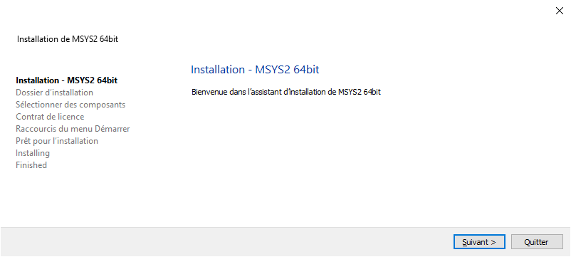

Cliquez sur le bouton « Suivant » :

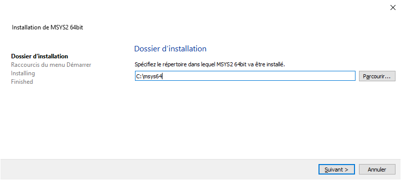

Assurez-vous que le dossier d'installation est bien « C:\msys64 » et cliquez sur le bouton « Suivant » :

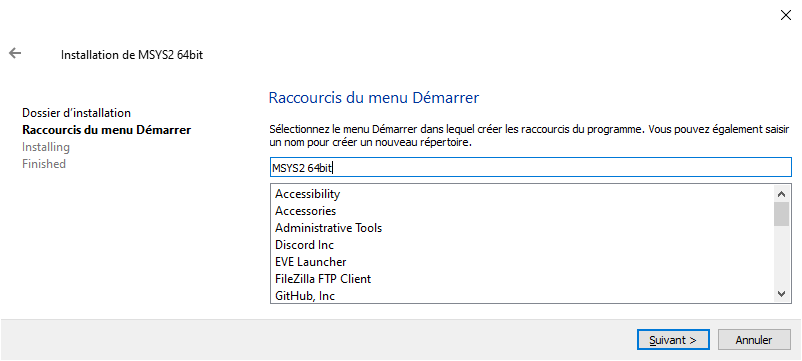

Cliquez sur le bouton « Suivant » et patientez durant l'installation :

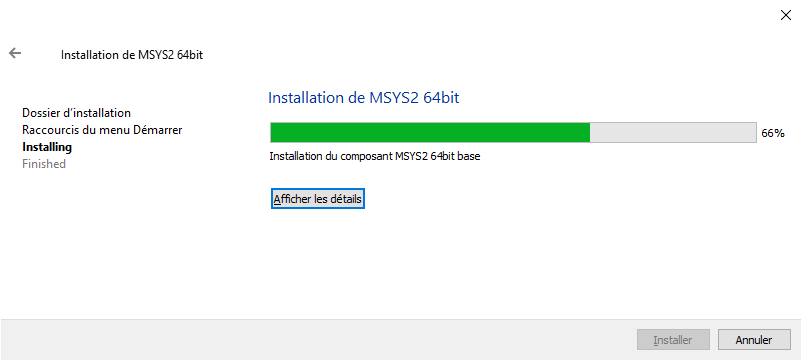

Assurez-vous que la case « Exécutez MSYS2 64bits maintenant » est cochée et cliquez sur le bouton « Terminer » :

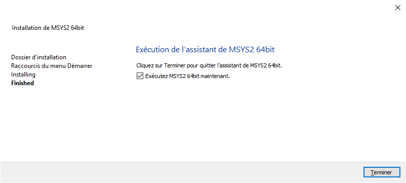

Si l'installation a réussi, un terminal apparaîtra :

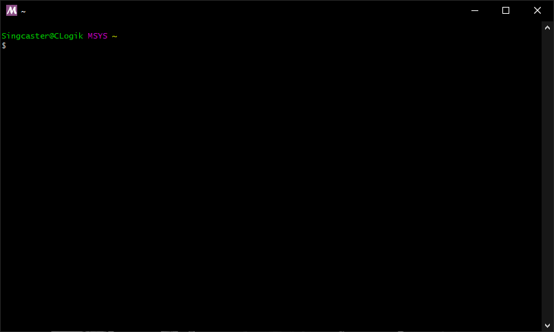

## Mise à jour

Pour mettre à jour la distribution, saisissez l'instruction suivante et appuyez sur la touche « Entrée » :

```
pacman -Suy
```

*Attention de bien respecter la casse, dont le « S » qui est majuscule.*

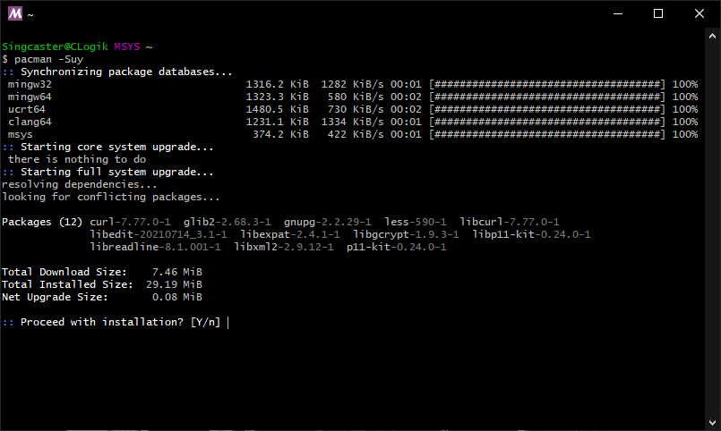

Appuyez sur la touche « Entrée » :

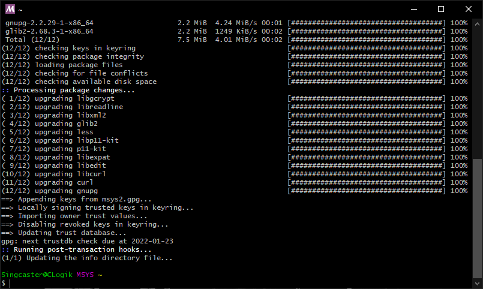

## Outils de développement

Pour installer le compilateur, le lieur et le débogueur, saisissez l'instruction suivante et appuyez sur la touche « Entrée » :

```
pacman -S --needed base-devel mingw-w64-x86_64-toolchain
```

*Attention de bien respecter la casse, dont le « S » qui est majuscule.*

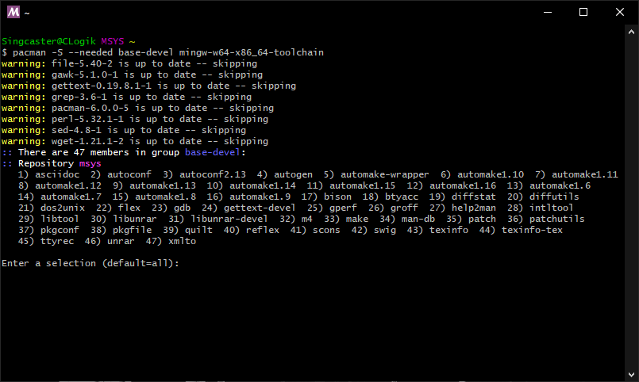

Appuyez sur la touche « Entrée » :

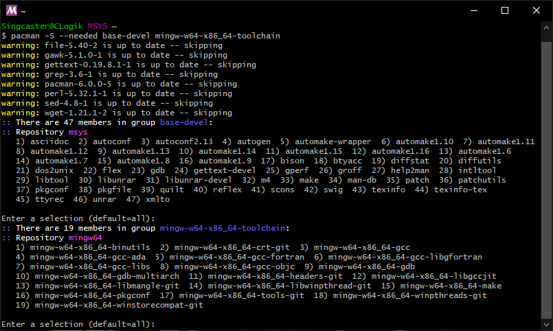

Appuyez sur la touche « Entrée » :

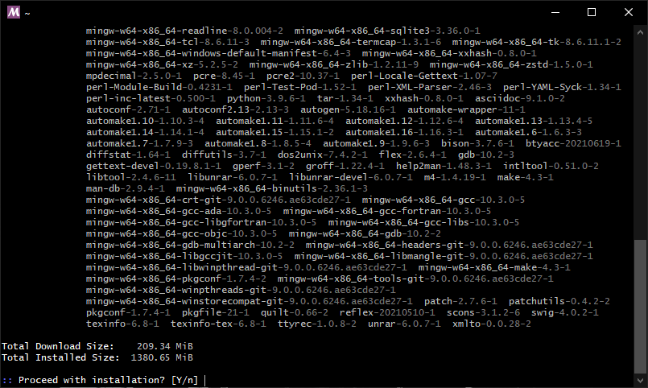

Appuyez sur la touche « Entrée » :

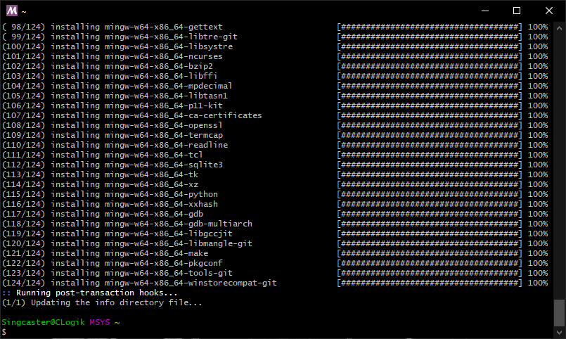

## Librairie graphique

Pour installer la librairie graphique SDL2, saisissez l'instruction suivante et appuyez sur la touche « Entrée » :

```
pacman -S mingw-w64-x86_64-SDL2 mingw-w64-x86_64-SDL2_ttf mingw-w64-x86_64-SDL2_image
```

*Attention de bien respecter la casse, dont le « S » qui est majuscule.*

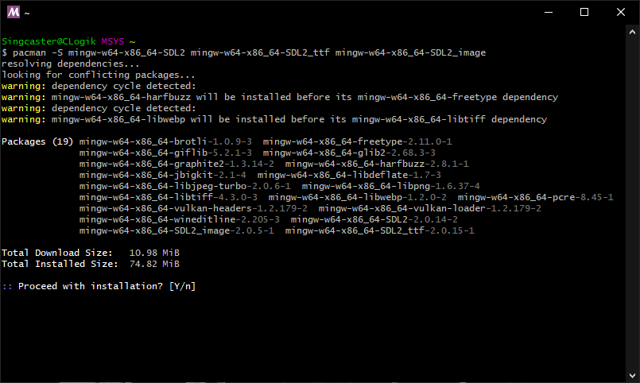

Appuyez sur la touche « Entrée » :

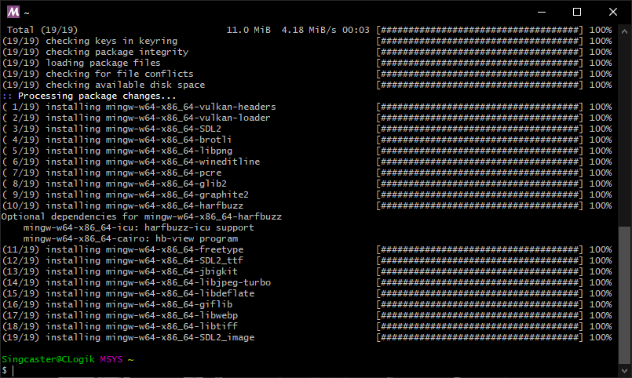

Saisissez l'instruction suivante pour quitter le terminal :

```
exit
```

## Configuration

Dans le menu « Démarrer » de Windows, saisissez « variable » et cliquez sur « Modifier les variables d'environnement système » :

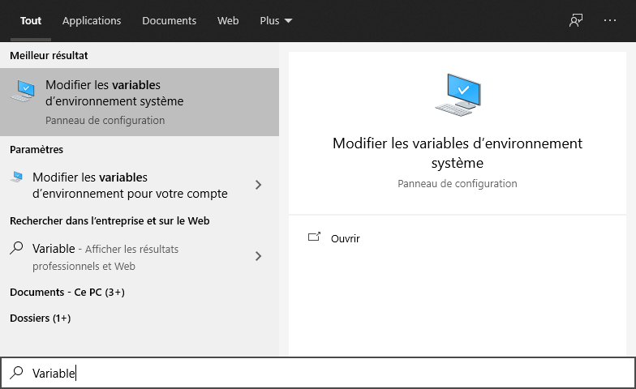

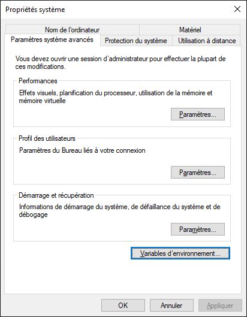

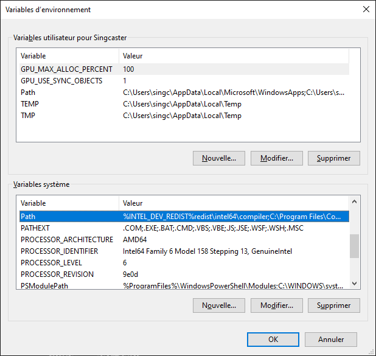

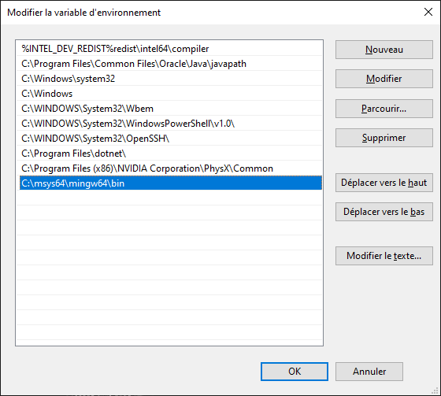
